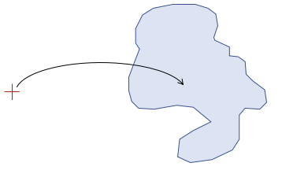

# Current Addresses to Catchments Linkset
This code repository contains a Linkset - a specialised Dataset linking objects in two other Datasets.

This Linkset contains spatial associations between [`Address`](http://linked.data.gov.au/def/gnaf#Address) class objects in the latest version of the Geocoded National Address File (GNAF Current) and `Catchment` class objects in the [Geofabric](linked.data.gov.au/dataset/geofabric).

Addresses, in the [GNAF 2016 May dataset](http://linked.data.gov.au/dataset/gnaf), are represented spatially as points. Catchments, in the [Geofabric](linked.data.gov.au/dataset/geofabric), are represented spatially as polygons. Catchments do not overlap and cover all of Australia, so any GNAF Current Address will lie within one, and only one, Catchment.

The formal definition of what a Linkset is, is provided by the Location Index (LocI) project within its project ontology, see:

* http://linked.data.gov.au/def/loci 

  
**Figure 1**: A geocoded address ('+', top layer) linked to a catchment polygon (bottom layer). Each *link* in this Linkset states a geocoded address ID, a catchment ID, the relationship type (always `geo:sfWithin`), a method used to make the link and the ID of the link itself.


## Repository Contents  
* [data00.ttl.gz](data00.ttl.gz) & [data01.ttl.gz](data01.ttl.gz) - this Linkset’s main data files. They are compressed RDF turtle files, each less than 100MB
* [header.ttl](header.ttl) - this Linkset’s data.ttl header information, stored separately for ease of access
* [example-data.ttl](example-data.ttl) - 10 Statements from the Linkset for ease of access, in RDF (turtle) format, as per the main data file
  * [example-data.csv](example-data.csv) - 10 Statements from the Linkset for ease of access, in simple CSV format
* [README.md](README.md) - this file
* [LICENSE](LICENSE) - the data license assigned to this Linkset’s content
* [overview.png](overview.png) - the image above
* [methods/](methods/) - a folder containing information (prose and code) about how this Linkset was generated


## Purpose
This repository contains a Linkset. [Linkset](http://linked.data.gov.au/def/loci#Linkset)s are specialised Linked Data datasets that link objects, such as Addresses or Catchments, in one Linked Data dataset to objects in another.

Publishing relationships between Datasets as distinct Linksets allows for the independent management of Dataset-to-Dataset relationships.

### Linksets for Spatial Relationships
Where LocI objects across multiple datasets have spatial relationships that we wish to represent, we create Linksets with spatial (topological) relationships such as touches, within, overlaps etc. using terms formalised in the (GeoSPARQL Standard](https://www.opengeospatial.org/standards/geosparql).

### Linksets for Dataset versions
Some LocI Datasets, such as the ASGS, have multiple, independently delivered versions (the ASGS is released as a Linked Data Datasets in both [2011](http://linked.data.gov.au/dataset/asgs2011) and [2016](http://linked.data.gov.au/dataset/asgs2016) versions). Linksets can be used to link between these versions of a Dataset too. This allows for information such as correspondence tables (links between ASGS versions, published by the Australian Bureau of Statistics) to be published as Linked Data independently of any other Dataset.

### This Linkset
This Linkset - GNAF Current Addresses to Geofabric Catchments Linkset - is a spatial relations Linkset linking GNAF Current Addresses (points) to Geofabric Catchments (polygons) by indicating which Catchment each Address is within.

This Linkset states, per Address and with other details, something like this:

Address GAACT714845933  
*is within*  
Catchment 7155143  

...and that this particular link was made on the 6th of February, 2015 using a Parcel Level matching method.


## How is a Linkset’s data organised?
Linksets include the main facts of relations between objects in two datasets - what the IDs of two objects are and how they are related - and they also include information about how links were created, such as what spatial intersection method was used to establish a topological relation. Linkset generation might have employed multiple methods to make all the object-to-object links within it so a Linkset may relate multiple methods and give the particular method used for each link.

Other per-link information may be recorded too: if the links within a Linkset are generated over a significant period of time then the each link may have a created time; if different people/organisations contributed different links then each link may reference their specific contributor.

### Linkset content sections
Linksets use a highly condensed, but still (sort of) human-readable data format to include many (millions) of links. Linkset data files contain:

* **A header**
  * Basic information about the Linksets - what, who when
  * Links to methods used in the generation of the Linkset
* **A (long) set of Statements**
  * One Statement per link
  * Link type - how the two objects relate, spatially or otherwise
  * Link metadata - time of creation (if important), method used and who created it (if known) etc.

Linksets include all their information in one potentially very large file but they also include the header information in a stand-alone text file - header.ttl.

They also include a few (perhaps 10) example Statements in a stand-alone text file - example-data-… .ttl (numbered as there may be many).

### Linkset files
In addition to the main Linkset data file and the header.ttl and example-data.ttl files, there are usually several other files within a Linkset, including this README file. General Linkset files include:

* **data.ttl** - the main Linkset data file. 
  * since this could be very large (1.5GB+), it is often compressed (*data.ttl.gz*) and sometimes split into parts (*data01.ttl.gz*, *data02.ttl.gz*...)
* **header.ttl** - the Linkset’s data.ttl header information, stored separately for ease of access
* **example-data.ttl** - a few statements (perhaps 10) from the Linkset for ease of access
* **README.md** - this file: a description of this Linkset and general Linkset information
* **LICENSE** - the data license assigned to this Linkset’s content

This specific Linkset’s files are listed in above in Repository Content.

### Linkset data format
In its long list of statements, this Linkset expresses each link like this:

* Statement 1 says:
  * Address GAACT714845933
  * is within
  * Catchment 7155143
  * Link generated via SpatialIntersection Method

In RDF code  this link is expressed as:

```
:1 a rdf:Statement ;
  rdf:subject:     address:GAACT714845933 ;
  rdf:predicate: geo:sfWithin ;
  rdf:object       catchment:7155143 ;
  loci:hadGenerationMethod: :SpatialIntersection 
.
```

With contractions used to save data volumes resulting in:

```
:1
  s: g:GAACT714845933 ;
  p: w: ;
  o: b:7155143 ;
  m: :SpatialIntersection ;
.
```

See the file [example-data.ttl](example-data.ttl) for the first 10 Statements of the Linkset expressed like this and see the [header.ttl](header.ttl) file to explain all the contractions.


## Linkset metrics
Linksets always contain similar information - links between objects in datasets - and a standard set of metrics can be calculated for any Linkset. These metrics, set by the LocI project, are:

* Number of links
* Number of items in Dataset A (from) not linked
* Number of items in Dataset B (to) not linked
* Number of link creation methods used
* Numbers of uses of each link-creation method

### Metric calculation
A series of queries to calculate Linkset metrics is being prepared here: <https://github.com/CSIRO-enviro-informatics/linkset-metrics>

### This Linkset’s metrics
**Metric** | **Value**
-- | --
Number of links | 14502000
Number of items in Dataset A (from) not linked | *not yet calculated* 
Number of items in Dataset B (to) not linked | *not yet calculated*
Number of link creation methods used | 1 ([Spatial Intersection](http://linked.data.gov.au/linkset/addrcatch/SpatialIntersection))
Numbers of uses of each link-creation method | 14502000


## Rights & License
The content of this API is licensed for use under the [Creative Commons 4.0 License](https://creativecommons.org/licenses/by/4.0/). See the [license deed](LICENSE) all details.


## Contacts
*LocI Project technical owner*:  
**Nicholas Car**  
CSIRO Land & Water, Environmental Informatics Group  
<nicholas.car@csiro.au>  

*Linkset creator*:  
**Joesph Abhayaratna**  
CTO, PSMA Ltd.   
<joseph.abhayaratna@psma.com.au>  
