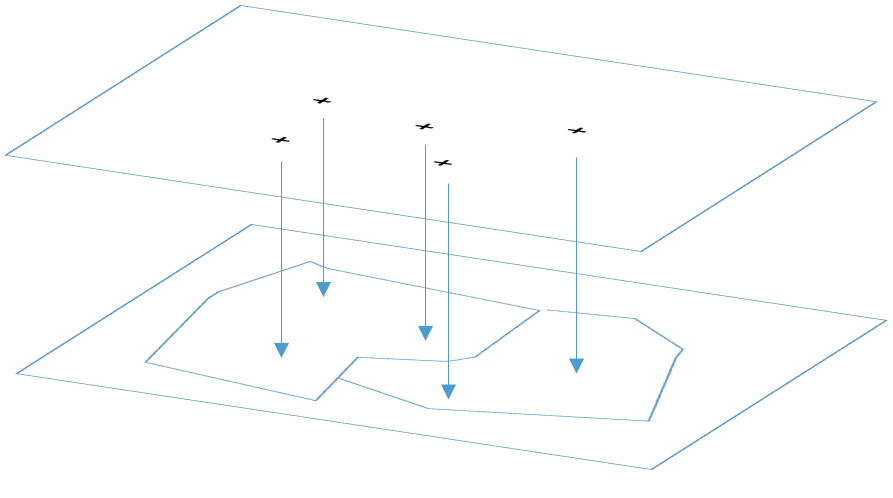

# Addresses/Catchments Linkset
Links between [GNAF](linked.data.gov.au/dataset/gnaf) Addresses and [Geofabric](linked.data.gov.au/dataset/geofabric) Catchments.

  
**Figure 1**: A geocoded address ('+', top layer) linked to a catchment polygon (bottom layer). Each *link* in this Linkset states a geocoded address ID, a catchment ID, the relationship type (always `geo:sfWithin`), a method used to make the link and the ID of the link itself.

This is a LOC-I Project Linkset which is a specialised Dataset containing [RDF](https://www.w3.org/2001/sw/wiki/RDF) links between other LOC-I Project Linked Data Datasets. It is formulated according to the [VoID Linkset](https://www.w3.org/TR/void/) definition meaning that in addition to the actual links, some whole-of-Linkset metadata about who created the links and when is present as a dataset header.

## LOC-I Linksets's additional information
In addition to expected VoID Linkset information, this Linkset presents some additional per-link information. Where VoID would typically have a link of the form:

```
<DATATASET_A_OBJECT_ID_AA> <PREDICATE_X> <DATASET_B_OBJECT_ID_BB> .
```
showing that `OBJECT_AA` from `DATASET_A` is linked to `OBJECT_BB` from `DATASET_B` via the predicate `PREDICATE_X`, this Linkset, and other LOC-I Linksets has links of the form:

```
<STATEMENT_ID_N>
  rdf:subject <DATATASET_A_OBJECT_ID_AA> ;
  rdf:predicate <PREDICATE_X> ;
  rdf:object <DATASET_B_OBJECT_ID_BB> ;
  loci:hadGenerationMethod <METHOD_M> .
```

showing that `OBJECT_AA` is related to `OBJECT_BB` via `PREDICATE_X` but that the relation has an identifier, `STATEMENT_N` allowing it to be directly referenced and any amount of other metadata, such as a reference to the method used to generate this link, in this case `METHOD_M` indicated by the predicate `loci:hadGenerationMethod`.

This is an example of <a href="https://en.wikipedia.org/wiki/Reification_(computer_science)#RDF_and_OWL">RDF reification</a> where a typical RDF relation of a *Subject*, *Predicate* and *Object* is described as an `rdf:Statement` class object with the *Subject*, *Predicate* and *Object* values being indicated by `rdf:subject`, `rdf:predicate` and `rdf:object` properties from the base RDF ontology and other information, such as provenance information, like the reference to the method used to generate the relation here, added to the `rdf:Statement` class just as any RDF information is added to any other class.


## This Linkset's contents
This Linkset consists of the following files:

* **[README.md](README.md)** - this file, providing an introduction to the Linkset
* **ac.ttl** - the Linkset data file. A 971MB RDF file, turtle format, encoding the total Linkset header information and data.
  * as this file is large, it is not contained within this repository but is available online at <http://gnafld.net/ac/ac.ttl>
* **ac.csv** - A 432MB CSV file containing 3 columns per row: Statement ID, Address ID, Catchment ID. This is a "shortcut" file for the Linkset's data
  * as this file is large, it is not contained within this repository but is available online at <http://gnafld.net/ac/ac.csv>
* **[header.ttl](header.ttl)** - the header information of this Linkset in RDF (turtle) which includes:
  * the Linkset metadata (title, description, contact point, date issued, date modified, creator, objectsTarget, subjectsTarget)
  * the SpatialIntersection method metadata (label, comment, link to code repo <https://github.com/jabhay/linkset_creator>, creator and created time)
  * URI prefixes for the RDF data file
* **[ac-10rows.ttl](ac-10rows.ttl)** - the top 10 "rows" (links) of the linkset in RDF (turtle), without header information
  * this file allows you to preview the data of the full linkset file
* **[ac-10rows.csv](ac-10rows.csv)** - the top 10 "rows" (links) of the linkset in CSV format
* **[commands.sh](commands.sh)** - some simple shell scripts to convert the data CSV file into RDF (turtle) and to do a few other small admin tasks


## License
The content of this API is licensed for use under the [Creative Commons 4.0 License](https://creativecommons.org/licenses/by/4.0/). See the [license deed](LICENSE) all details.


## Contacts
*Author*:  
**Nicholas Car**  
*Senior Experimental Scientist*  
CSIRO Land & Water, Environmental Informatics Group  
<nicholas.car@csiro.au>
